<h1 align="center">Salut 👋</h1>

Je suis un lycéen passionné par l'informatique et l'électronique. Pendant mon temps libre, je développe des projets variés : bots Discord, site web, outils, ainsi que des expérimentations avec des Raspberry Pi et Arduino.

<h3 align="left">🌐 Réseaux:</h3>

<h3 align="left">💻 Languages et outils 🔧:</h3>

           

## 📊 GitHub Stats:

