Je suis un lycéen passionné par l'informatique et l'électronique. J'adore coder et créer des projets numériques dans mon temps libre. Que ce soit développer des bots discord, des applications qui me permettent de réaliser des choses sans passer par des services exterieurs, des jeux vidéo ou bidouiller avec de l'électronique comme des Raspberry Pi, Arduino etc. 
Je suis toujours enchanté par l'idée d'apprendre et explorer ces domaines. J'aime relever des défis techniques, trouver des solutions créatives à des problèmes, et continuer à approfondir mes connaissances.  
C'est un secteur dans lequel je pense me diriger à l'avenir. En attendant, je continue à travailler sur mes compétences en programmation et en électronique à travers des projets personnels et mon parcours scolaire. 

<h3 align="left">🌐 Réseaux:</h3>

<h3 align="left">💻 Languages et outils 🔧:</h3>

           

## 📊 GitHub Stats:

